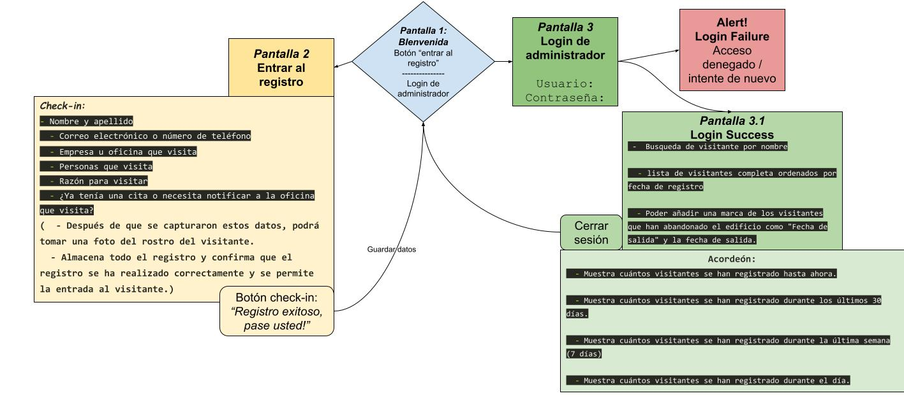
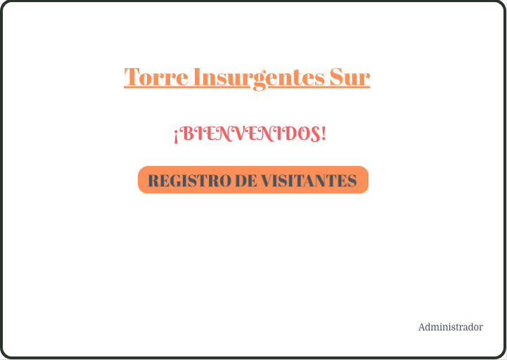
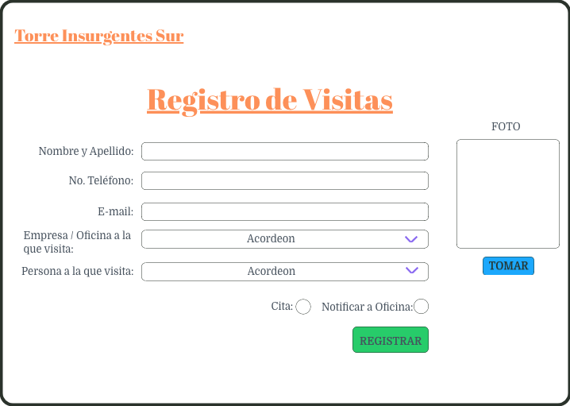
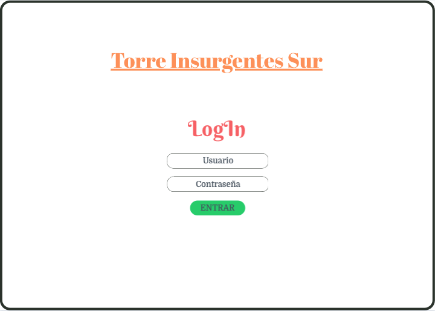
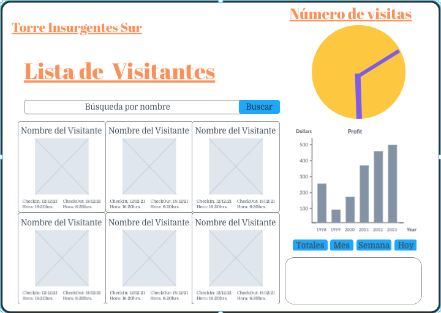

# 07_Visitors_Reception

Central de recepción de visitantes construida con JavaScript, HTML, CSS y Firebase.

El registro de visitantes en un imueble o evento contribuye a consolidar diversos protocolos de seguridad que promuevan la confidencialidad de la información que en el mismo se puedan compartir y sobretodo, para resguardar el bienestar de quienes lo utilizan, esto incluye mejorar las medidas de emergencia en caso de sismo y/ o incendio y desarrollar mejoras en la prevención de la propagación de enfermedades junto con los protocolos de sanidad que la administración del recinto acuerde con el ingreso de sus visitantes.

El registro de los datos de la gente que ingresa al inmueble facilita tener un control de su información y con ello coadyuvar a la gestión y toma de desiciones que los directivos consideren pertinente en el devenir de su funcionalidad.

Por ello se ha diseñado esta aplicación web que facilita la dministración, registro de cada ingreso y salida de sus visitantes, con la información de contacto personal y una foto de su rostro, el motivo y las personas u oficina que visita, así como permitir a los administradores ver las personas registradas actualmente, realizar consultas analíticas básicas de la misma, incluyendo cuánta gente ha ingresado durante los últimos días, entre otros números específicos. Esta aplicación se compromete a ser ecofriendly al permitir ahorrar grandes cantidades de papel y muy práctica al poder utilizarse desde un dispositivo tecnológico de información tal como una Tablet situada en el lobby del recinto.

## 1. Descripción

Aplicación web para tableta para registro digital de visitantes en la entrada del edificio coworking "Torre Insurgentes Sur" el cual cuenta con 8 pisos, cada piso con 2 oficinas, cada oficina tiene al menos un trabajador base. La aplicación web también tiene una vista de administrador privada, para ver los registros actuales del día y los números importantes como cuántos registros durante el mes, la semana y el día. También las oficinas con más visitantes y la lista completa de visitantes totales.

## 2. Definición de usuario

- Usuario 1: Visitantes del edificio coworking Torre Insurgentes Sur

- Usuario 2: administradores de recepción del edificio de coworking Torre Insurgentes Surgit, conserje

## 3. User Stories

La interfaz debe permitir a los visitantes:

- Tocar y/o hacer clic para registrarse:

  - Nombre y apellido

  - Correo electrónico o número de teléfono

  - Empresa u oficina que visita

  - Persona que visita

  - Razón para visitar

  - Si ya tenía una cita o necesita notificar a la oficina que visita

  - Después de que se capturaron estos datos, podrá tomar una foto del rostro del visitante.

  - Almacene todo el registro y confirme que el registro se ha realizado correctamente y se permite la entrada al visitante.

- La interfaz para los administradores de trabajo conjunto (no debe ser visible como primera vista para los visitantes):

  - Muestra una vista privada con contraseña de acceso

  - Muestra la lista de visitantes completa ordenados por fecha de registro

  - Muestra cuántos visitantes se han registrado hasta ahora.

  - Muestra cuántos visitantes se han registrado durante los últimos 30 días.

  - Muestra cuántos visitantes se han registrado durante la última semana (7 días)

  - Muestra cuántos visitantes se han registrado durante el día.

  - Poder añadir una marca de los visitantes que han abandonado el edificio como "Fecha de salida" y la fecha de salida.

## 4. Diagrama de flujo

## 5. Boceto y Maquetado

## Scripts Files

- `README.md`: should explain the about of the project, the technology used, the users definitions and the flow chart and prototypes, as well document all the SDLC steps
- `assets /`: Should contain your assets like images, logos, etc.
- `src / index.html`: this is the entry point to your application. This file must contain to _markup_ (HTML). From this entry point the app must redirect if visitor wants to register or if loged as admin to other views.
- `src / app.js`: here you must listen to DOM events and generate the logic to redirect to each module, admin and view.
- `src / visitors.html`: This is the view for the visitors
- `src / visitors.js`: here you must write new Database entries to the Firestore Database.
- `src / admin.html`: This is the view for the administrators dashboard.
- `src / admin.js`: here you must implement the web application main functionality to interact with the users.
- `src / administration.js`: here you must fetch/get the database registrations to show it into the admin view

## Expected Learning Outcomes

---

- [ ] npm init
- [ ] JSON
- [ ] ASYNC AWAIT
- [ ] DB Firestore
- [ ] My first CRUD in Firebase
- [ ] My first Data Structuring project
- [ ] Access to Operative System feature: camera
- [ ] Array methods and iterators
- [ ] object iterators and key finders
- [ ] import & export modules
- [ ] GitHub Branch Modeling > Development > Release

---
